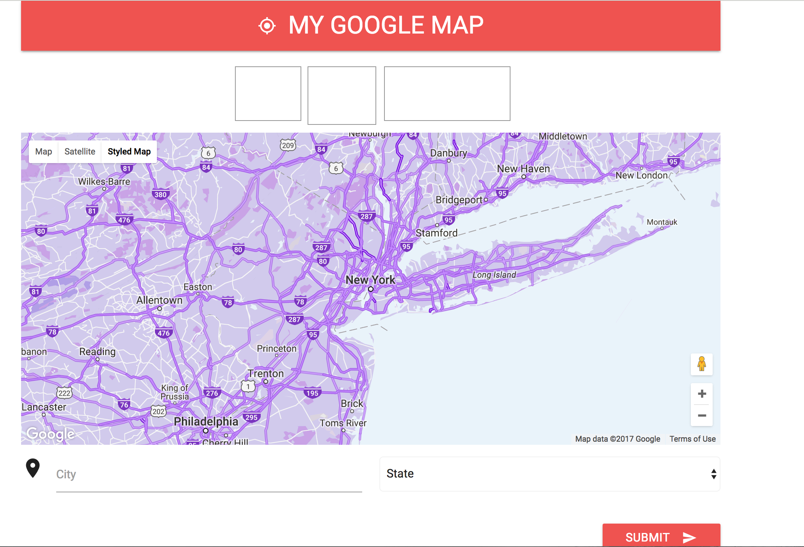
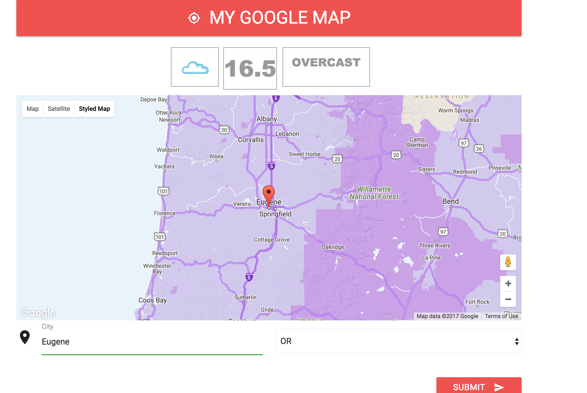

# Assignment 02

**RESTful Project**

**Due Date: Week 11 - Midnight of 4/5/2017**

## :star2: [Accept Assignment](https://classroom.github.com/assignment-invitations/36e19048eb7663ae1786db6d71333cef)

## Assignment Specification
Develop a small project using a RESTful API of your own choice. 
You may combine two or more APIs if you need to.
*The only minimum requirement is to demonstrate usage at least 5 different API requests*

Projects for inspiration
* [Data Visualizations](http://flowingdata.com/)
* [Bot: Moth Generator](https://twitter.com/mothgenerator)
* [Generative Visuals](https://mattdesl.svbtle.com/generative-art-with-nodejs-and-canvas)
* [NASA's Data Portal](https://data.nasa.gov/developer)
* [NYC Open Data](http://opendata.cityofnewyork.us/)
* [Cyclone.js for IOT Projects](https://cylonjs.com/)

## Resources
* [Google Map Api](https://developers.google.com/maps/)
* [Weather Api](https://www.wunderground.com/weather/api)
* CcLab api project and tutorial

